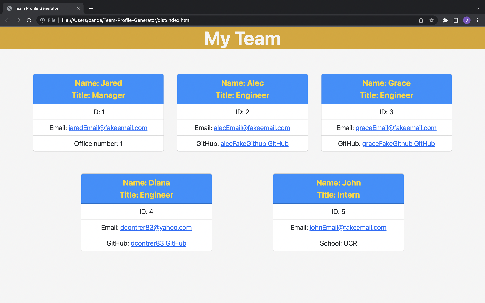

# Team Profile Generator

  

  ## Description 

  In this application the user will be able create an HTML file using employee info. The webpage will include a manager and the amount of employees needed for engineers and interns. Each employee will have a card that includes name, ID, and email. Manager has an office number, Engineer has a github profile link, and Intern has the school they are attending. This is created by the user typing responses to questions in the terminal using inquirer (8.2.4).

  ## Table of Contents

  - [Installation](#installation)
  - [Usage](#usage)
  - [Test](#test)
  - [Walkthrough](#Walkthrough)
  - [Screenshot](#Screenshot)
  - [Link](#Link)
  - [License](#license)
  - [Questions](#questions)

  ## Installation

  - download all files from this GitHub Repo
  - install jest
  - install inquirer version 8.2.4

  ## Usage

  - in the terminal type `node index.js`
  - answer the following questions
  - once you finish, a HTML file will be created with your inputs located in the dist folder

  ## Test

  - to run tests make sure to have jest installed 
  - type `npm test` to run all test in the terminal
  - for individual test type `npm test -- <file_name>`
  - these tests will make sure user input is being collected correctly to be able to use to create the HTML file.

  ## Walkthrough

  

  [Walkthrough Video Link](https://drive.google.com/file/d/1JCSMTfKiTkA74Vh5mKxPYtsr2KxOZ154/view)

  ## Screenshot

  

  ## Link

  [Team Profile Generator Example](https://dcontrer83.github.io/Team-Profile-Generator/)

  ## License

  The license that is used for this project is: MIT License

  For more information please go to: https://choosealicense.com/licenses/mit/

  ## Questions

  GitHub Username: dcontrer83

  Link to GitHub profile: [dcontrer83 GitHub Profile](https://github.com/dcontrer83)

  Email Address: dcontrer83@yahoo.com

